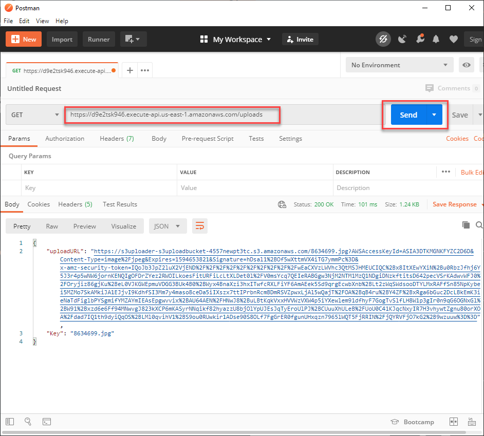

# S3 presigned URLs with SAM

This  application shows how to upload objects to S3 directly from your end-user application using Signed URLs.


```bash
.
├── README.MD                   <-- This instructions file

├── getSignedURL                <-- Source code for the serverless backend
```

## Requirements

* AWS CLI already configured with Administrator permission
* [AWS SAM CLI installed](https://docs.aws.amazon.com/serverless-application-model/latest/developerguide/serverless-sam-cli-install.html) - minimum version 0.48.
* [NodeJS 12.x installed](https://nodejs.org/en/download/)

## Installation Instructions

1. [Create an AWS account](https://portal.aws.amazon.com/gp/aws/developer/registration/index.html) if you do not already have one and login.

2. Clone the repo onto your local development machine using `git clone`.

### Installing the application

```
cd .. 
sam deploy --guided
```

When prompted for parameters, enter:
- Stack Name: <your stack name>
- AWS Region: your preferred AWS Region (e.g. us-east-1)
- Accept all other defaults.

This takes several minutes to deploy. At the end of the deployment, note the output values, as you need these later.

- The APIendpoint value is important - it looks like https://ab123345677.execute-api.us-east-1.amazonaws.com.

- **The upload URL is your endpoint** with the /uploads route added - for example: https://ab123345677.execute-api.us-wast-1.amazonaws.com/uploads.


### Testing with postman

1- First, copy the API endpoint from the output of the deployment.
2- In the Postman interface, paste the API endpoint into the box labeled Enter request URL.
3- Choose Send.



4- After the request is complete, the Body section shows a JSON response. The uploadURL attribute 
contains the signed URL. Click on this attribute to the clipboard.
5- Will open a new tab
6- Using the dropdown, change the method from GET to PUT. 
7- Choose the Body tab, then the binary radio button.
8- Choose Select file and choose a JPG file to upload.
9- Choose Send. You see a 200 OK response after the file is uploaded.
10 -Navigate to the S3 console, and open the S3 bucket created by the deployment. In the bucket, you see the JPG file uploaded via Postman.

### Deleting your Stack
Make sure that your bucket is empty
Run
'''
sam delete
'''

